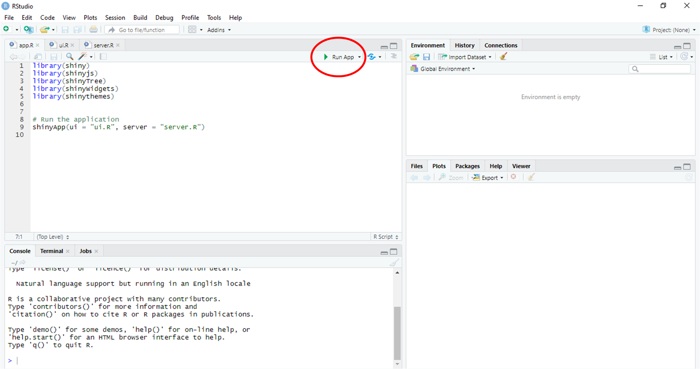
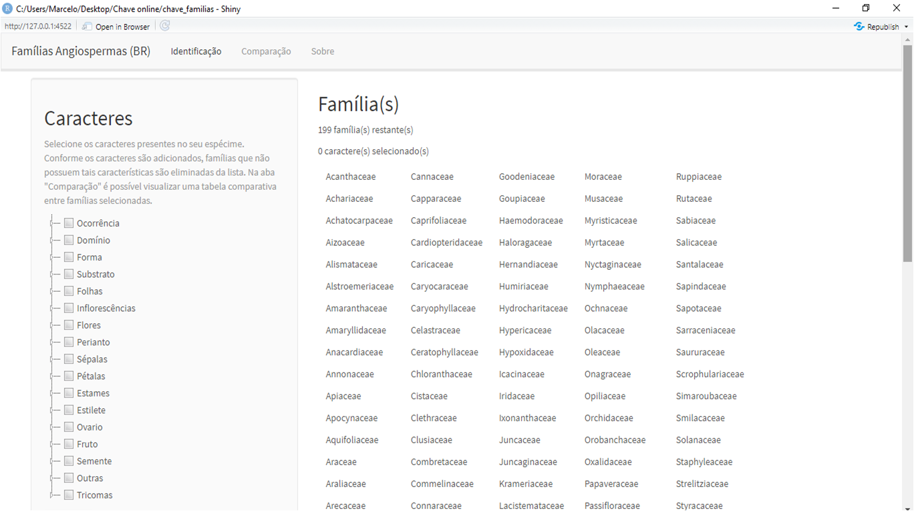
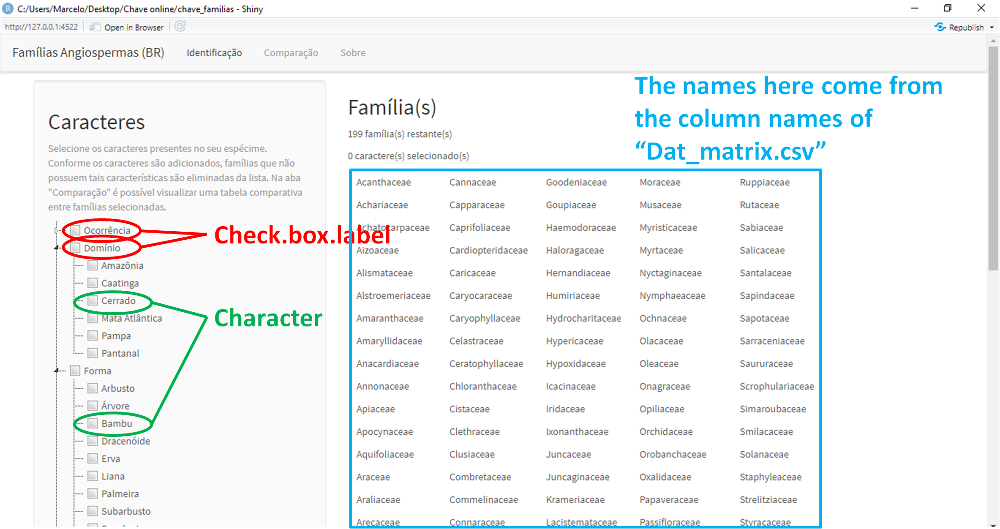
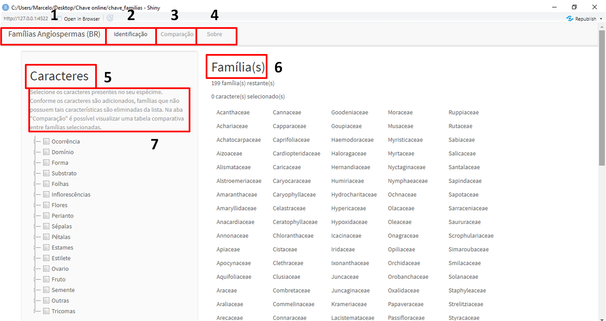
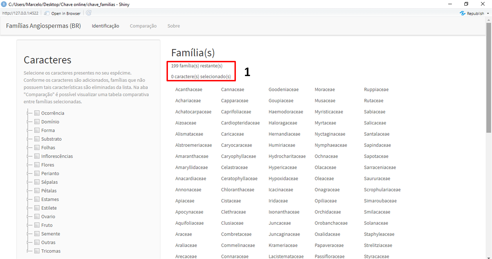
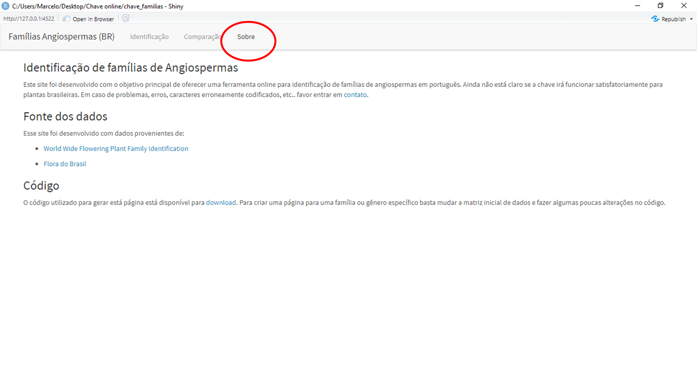
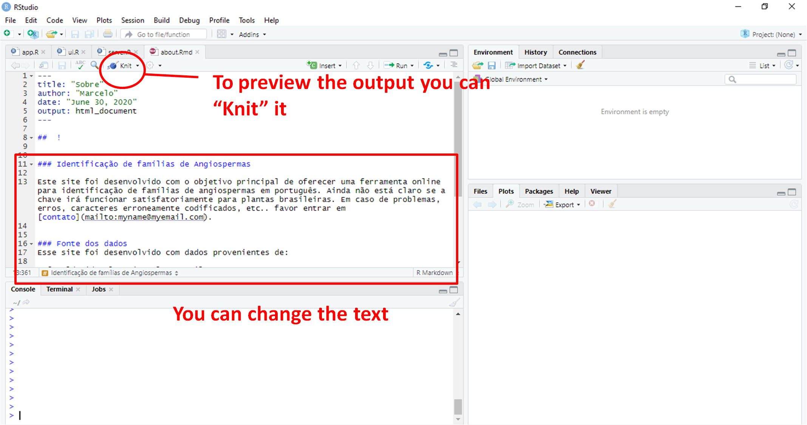

Adapting the key
================

Adapting this interative key to another data set (family, genus, etc..)
should not be difficult. In the following lines there is an explanantion
about the important steps required to acomplish that.

## Download the code and data

First [download](https://github.com/mreginato/Chave_familias_BR) the
following files from the github repository:

  - Code files:
      - app.R
      - server.R
      - ui.R
  - Data files:
      - Dat\_characters.csv
      - Dat\_matrix.csv
  - About file:
      - about.Rmd

*Place all files in the same directory.*

## Test locally

First, try to run the app localy “as it is”, just to check.

  - In Rstudio, open the code files “app.R”, “server.R”, and “ui.R”
  - In the right corner of the code panel the button “Run app” should
    appear
  - Run it
  - You may have to install the following packages before:
      - library(markdown)
      - library(shiny)
      - library(shinyjs)
      - library(shinyTree)
      - library(shinyWidgets)
      - library(shinythemes)

  - A new window should pop up with the webpage

If you got the webpage running locally now we can modify it.

## Changing the data

The data behind the key are stored in two files:

  - Dat\_characters.csv - It contains the “names” of the characters
    (column “Character”), as well as their “grouping” that will be used
    to generate the character’s option of the key (columns
    “Check.box.label” and “Check.box.id”).
    
      - Check.box.label -\> should *not* have spaces
      - Check.box.id -\> it is only used internally (does not appear in
        the website and could be the same as “Check.box.label”)

  - Dat\_matrix.csv - It contains the data itself, with presence (1) /
    absence (0). Taxa (in our exemple families) are stored in the
    columns and the characters are placed in the rows. Characters are
    not named in this matrix (they have a number that should match the
    column “ID” of the “Dat\_characters.csv” file). It is a good idea to
    keep them in the same order of the “Dat\_characters.csv” file
    (column “ID”). The data matrix only includes the characters (i.e.,
    does not include the grouping variable).

**So, you can change the data inside of these two files, just remember
to keep the *exact* same format (including column names and file names),
then no change in the code itself will be necessary.**

## Changing the website - ui.R

In the “ui.R” file you can modify the appearance of the website,
including titles, text, and other elements.

Here is a list of the elements you may want to change and their place in
the “ui.R” file.

Position in the “ui.R” file:

1.  Line 50
2.  Line 54
3.  Line 91
4.  Line 143
5.  Line 60
6.  Line 79
7.  Line 61

*The text of the labels should be within “quotes”* *You can also do a
search by the original text in order to find in within the “ui.R”*

## Changing the website - server.R

There is not much to be changed in the “server.R” file. A few things
that could be changed:

That text is repeated in several lines n the “server.R” file:

1.  Lines 81, 82, 113, 114, 132, 133, 152, 153

## Changing the “About” page

The “About” page is an independent markdown file. To change its content,
open the file “about.Rmd” in Rstudio. Then, just replace the text after
Line 11 as you wish. See some “Rmarkdown” tutorials available online.

### That’s pretty much it\!\!

To learn how to launch you app online, go the [shiny
website](https://www.shinyapps.io/)
